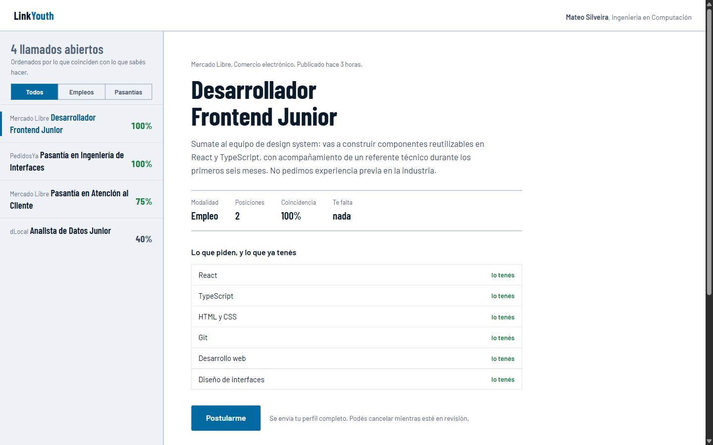
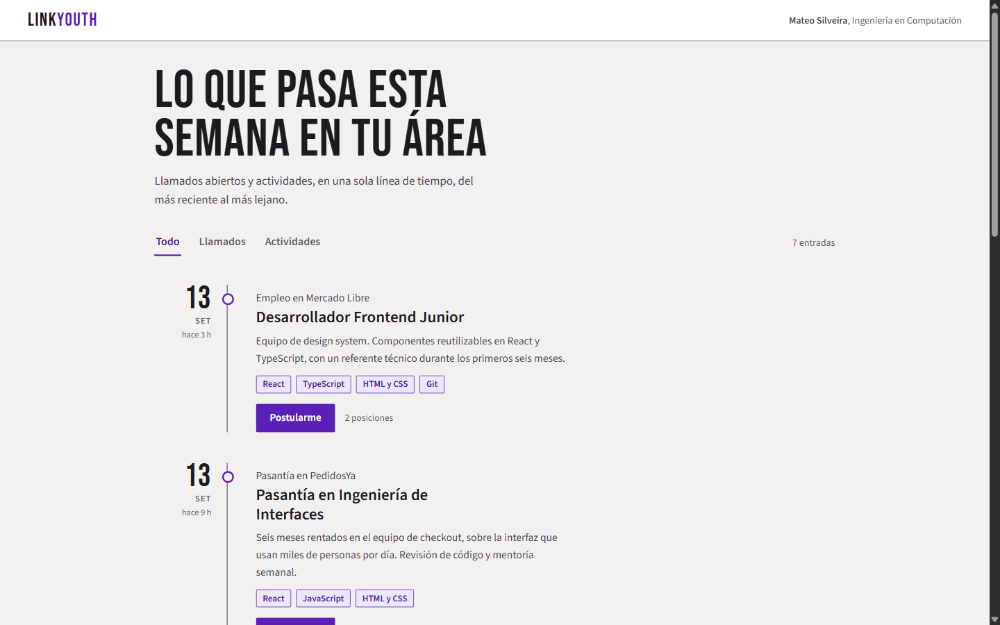
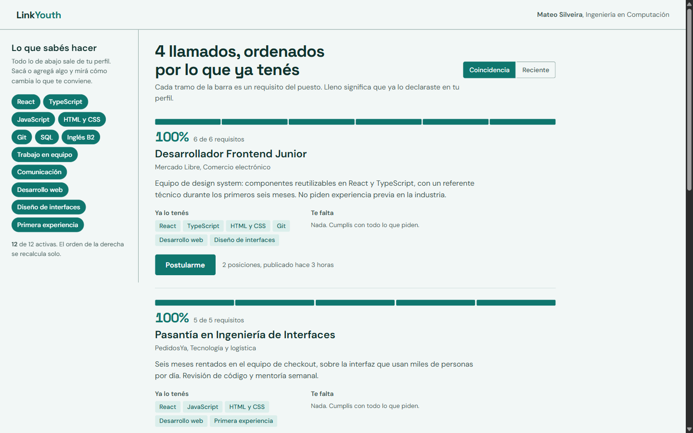

# Propuestas de diseño, v2: estructura

La v1 (`propuestas-diseno.md`) cambiaba paleta y tipografía sobre el mismo
layout. Probadas, las tres seguían sintiéndose genéricas. Tenía razón el
diagnóstico: **el problema no es el color, es la composición.**

Esta v2 no repinta nada. Rediseña `/inicio` —la pantalla que más usa el
postulante— en tres composiciones distintas, construidas como páginas reales
navegables.

- **Fecha:** 2026-09-13 · **Rama:** `main`, commit `30c7ed2`
- **Nada aplicado.** Los prototipos viven en `docs/propuestas-diseno-v2/`,
  fuera de `src/`. El código de la aplicación no se tocó.
- **Abrilos y usalos.** Son HTML sueltos, doble clic y andan. Tienen
  interacción real: se filtra, se selecciona, se recalcula.

| | Prototipo | Captura |
|---|---|---|
| A · Llamado | [`a-llamado.html`](./propuestas-diseno-v2/a-llamado.html) | [escritorio](./propuestas-diseno-v2/captura-a.png) · [390 px](./propuestas-diseno-v2/a-llamado-390.png) |
| B · Semanario | [`b-semanario.html`](./propuestas-diseno-v2/b-semanario.html) | [escritorio](./propuestas-diseno-v2/captura-b.png) · [390 px](./propuestas-diseno-v2/b-semanario-390.png) |
| C · Coincidencia | [`c-coincidencia.html`](./propuestas-diseno-v2/c-coincidencia.html) | [escritorio](./propuestas-diseno-v2/captura-c.png) · [390 px](./propuestas-diseno-v2/c-coincidencia-390.png) |

---

## 1. Qué delata el diseño actual

`frontend-design` describe cinco grupos en los que se agrupa el diseño
generado por IA. La interfaz de hoy cae de lleno en dos, y son estructurales,
no cromáticos.

### El grupo «kit de tarjetas SaaS»

> *«contenido picado en tarjetas redondeadas idénticas, un solo radio para
> todo sin importar la jerarquía, la misma sombra gris suave debajo de cada
> una, y lavados de degradado como decoración»*

Es literalmente el sistema actual. Todo bloque de contenido —vacante, evento,
sección de perfil, estado vacío, ficha de usuario— es el mismo componente
`Tarjeta`, con el mismo `--radius-tarjeta: 0.875rem`, el mismo borde y la
misma `--shadow-tarjeta`. Una vacante y un cartel de «no hay nada todavía»
tienen exactamente el mismo peso visual. **La forma no codifica nada**: no se
puede saber qué es más importante mirando de reojo.

Y sí hay lavados de degradado como decoración pura:

```
src/components/perfil/TarjetaUsuario.tsx:30    h-16 bg-gradient-to-r from-[#1d4ed8] to-[#3b82f6]
src/components/eventos/TarjetaEvento.tsx:16-19 cuatro franjas de degradado fijas
```

### El grupo «chrome de plantilla»

> *«una etiqueta de ojo en MAYÚSCULAS espaciadas arriba de cada encabezado;
> cadenas de metadatos unidas con puntos medios ('A · B · C'); negro casi puro
> teñido (#0B0B0B, #111) en lugar de negro»*

Los tres, presentes:

```
src/components/empleos/TarjetaVacante.tsx:84   text-[11px] uppercase tracking-wide  →  "HABILIDADES"
src/components/empleos/TarjetaVacante.tsx:99   text-[11px] uppercase tracking-wide  →  "ÁREAS DE INTERÉS"
src/components/perfil/TarjetaUsuario.tsx:79    text-[11px] uppercase tracking-wide  →  "PRINCIPALES HABILIDADES"
src/components/empleos/TarjetaVacante.tsx:58   <span aria-hidden="true">·</span>
src/components/empleos/TarjetaVacante.tsx:60   <span aria-hidden="true">·</span>
src/app/globals.css                            --color-tinta: #101828
```

### Cinco patrones más, propios de esta aplicación

1. **Todo centrado a un ancho fijo.** `/empleos`, `/eventos` y
   `/postulaciones` son `mx-auto max-w-4xl`; `/perfil` es `max-w-3xl`. Columna
   única, márgenes simétricos, cero tensión. No hay ninguna decisión de
   composición: hay un contenedor.
2. **Pila plana sin ritmo.** `space-y-4` entre cada tarjeta, siempre el mismo.
   Nada se agrupa, nada respira distinto, nada se destaca. Un feed de cuatro
   vacantes se lee igual que una lista de cuarenta.
3. **Las tres columnas iguales.** `TarjetaUsuario.tsx:58` es
   `grid-cols-3 text-center` con «0 Habilidades / 0 Postulaciones / 0
   Estudios». Es el patrón de tres bloques idénticos que `frontend-design`
   nombra explícitamente.
4. **Cero elementos gráficos propios.** El único dibujo que no es texto ni
   ícono de librería es el cuadradito «LY». No hay marca, ni patrón, ni
   diagrama, ni ninguna forma que sea de este producto y de ningún otro.
5. **El diferencial, escondido en un chip.** La compatibilidad contra tus
   habilidades —lo único que LinkYouth hace y un portal de empleo común no—
   es una insignia de 12 px en la esquina, y encima `hidden … sm:block`
   (`TarjetaVacante.tsx:74`): en un teléfono directamente no existe.

El punto 5 es el importante. **Un diseño se siente genérico cuando su
composición no sabe de qué trata el producto.** El layout actual serviría
igual para un gestor de tareas o un blog. Las tres direcciones de abajo
atacan eso.

---

## 2. Las tres direcciones

Estilos tomados de la base de `ui-ux-pro-max`. Las paletas usan valores ya
medidos en la v1, a propósito: **acá la variable que se prueba es la
estructura, no el color.** Las tres dan 0 violaciones en axe-core y ninguna
desborda a 390 px.

| | Estilo base (ui-ux-pro-max) | Títulos / cuerpo | axe | 390 px |
|---|---|---|---|---|
| A | Editorial Grid / Magazine | Barlow Condensed / Barlow | 0 · 34 pasadas | sin desborde |
| B | Exaggerated Minimalism | Bebas Neue / Source Sans 3 | 0 · 31 pasadas | sin desborde |
| C | Minimalism & Swiss Style | Space Grotesk / DM Sans | 0 · 31 pasadas | sin desborde |

---

### A · «Llamado» — índice y expediente



**La decisión estructural.** Desaparece el feed de tarjetas apiladas y en su
lugar hay una grilla asimétrica fija de dos columnas de ancho muy distinto:
una de 330 px a la izquierda que es un índice denso de todos los llamados
abiertos —empresa, puesto y porcentaje, en tipografía condensada para que un
título largo entre sin cortarse— y el resto del ancho a la derecha ocupado
por un solo llamado desplegado a fondo, con un titular de 52 px. No hay
ninguna tarjeta en la pantalla: ni borde, ni sombra, ni radio; las entradas
del índice se separan con una línea de 1 px y la seleccionada se marca con
una barra de color de 4 px en el margen izquierdo, no con un bloque de fondo
pintado. El gesto propio es la tabla de cotejo: en vez de listar los
requisitos como chips indistinguibles, los pone en una grilla de dos columnas
donde cada fila dice «lo tenés» o «te falta» — la estructura pasa a ser la
información, que es exactamente lo que el layout de hoy no hace.

**Qué se pierde y qué se gana.** Se gana escaneo: se ven los cuatro llamados
y sus porcentajes de una sola mirada, sin scrollear. Se pierde la lectura
corrida del feed; hay que elegir para leer. Es el modelo de LinkedIn Jobs e
Indeed, y es el que mejor escala cuando haya cuarenta vacantes en vez de
cuatro.

**Costo de implementación.** Alto. Cambia el modelo de interacción de
`/inicio`, necesita estado de selección en la URL (`?llamado=`) y un
`TarjetaVacante` partido en dos componentes: fila de índice y expediente.

---

### B · «Semanario» — una sola línea de tiempo



**La decisión estructural.** Se cae la separación en pestañas entre
«Oportunidades laborales» y «Eventos de networking», y las dos cosas pasan a
un único flujo ordenado por fecha, colgado de un espinazo vertical continuo
que recorre toda la página; cada entrada sale de un punto sobre ese espinazo,
hueco si es un llamado y lleno si es una actividad. El elemento gráfico
propio es el numeral de fecha: un «13» de 46 px en Bebas Neue en el margen
izquierdo, que funciona como ancla visual y como separador, y que reemplaza
por completo al borde de tarjeta — no hay ni una tarjeta, ni una sombra, ni
una línea horizontal entre entradas; lo único que separa una de otra es el
espacio y el cambio de numeral. El encabezado de la página es un titular de
76 px que ocupa media pantalla y deja el resto en blanco a propósito: el
espacio negativo es la mitad del efecto.

**Qué se pierde y qué se gana.** Se gana una respuesta directa a la pregunta
real del postulante, que es «¿qué hay de nuevo?», y desaparece la decisión
artificial de elegir pestaña. Se pierde la capacidad de mirar sólo empleos sin
filtrar, y el orden por fecha compite con el orden por compatibilidad: si
mañana entran diez vacantes irrelevantes, tapan a la buena de ayer.

**Costo de implementación.** Medio. `/inicio` pasa a una consulta unificada
ordenada por fecha, y las pestañas se vuelven filtros. `TarjetaVacante` y
`TarjetaEvento` convergen en un solo componente de entrada.

---

### C · «Coincidencia» — el diferencial como estructura



**La decisión estructural.** El dato que hoy vive escondido en un chip de la
esquina pasa a organizar la pantalla entera: los llamados se ordenan por
compatibilidad y cada uno se encabeza con una barra segmentada, un tramo por
requisito del puesto, lleno si ya lo declaraste y vacío si no — un gráfico
dibujado con divs, propio de este producto, que no es un ícono de ninguna
librería y que no significa nada en ninguna otra aplicación. A la izquierda
hay una columna fija y angosta de 288 px con tus habilidades como botones que
se apagan y se prenden, y al tocarlas las barras se recalculan y la lista se
reordena en vivo: la pantalla deja de ser un listado y se vuelve un
instrumento. Tampoco hay tarjetas acá; cada llamado se separa del siguiente
por una línea de 1 px y por su propia barra, y el porcentaje en 28 px es lo
primero que se lee, antes que el título del puesto.

**Qué se pierde y qué se gana.** Se gana que el producto explique su propia
propuesta de valor sin un párrafo de marketing: mirás la barra y entendés qué
te falta. Se pierde neutralidad — un llamado con 20% queda visualmente
castigado aunque quizá valga la pena — y con los datos de demostración
actuales los dos primeros dan 100%, así que el gráfico recién se luce cuando
apagás habilidades en el panel izquierdo.

**Costo de implementación.** Medio-bajo. `afinidad()` ya existe y ya se
calcula (`src/lib/formato.ts:108`). El cambio es de presentación y de orden,
no de datos. El panel de habilidades interactivo es opcional en una primera
etapa.

---

## 3. Lo que hice distinto en los prototipos, y por qué

Cosas que el código de hoy hace y los tres prototipos evitan, por
recomendación explícita de `frontend-design`:

- **Ninguna etiqueta de ojo en mayúsculas.** En B llegué a poner un «EMPLEO /
  PASANTÍA» en Bebas arriba de cada título; lo saqué al revisar, porque es el
  tell exacto. Ahora esa información va en sentence case dentro de la línea de
  la empresa: «Pasantía en PedidosYa».
- **Ningún metadato con punto medio.** Donde hoy dice «Mercado Libre ·
  Comercio electrónico · hace 3 horas», los prototipos usan una frase
  («Mercado Libre, Comercio electrónico. Publicado hace 3 horas.») o separan
  en líneas distintas.
- **Ninguna flecha `→` en los botones.** Los botones dicen qué pasa:
  «Postularme», «Anotarme».
- **Radios distintos según jerarquía**, no un solo valor global.
- **Negro real, no negro teñido de azul.** Cada dirección usa un tinta con
  temperatura propia y declarada.

Verificado en navegador, no supuesto:

- Las tres corren axe-core con **0 violaciones**. A tenía un salto de nivel de
  encabezado (el índice arrancaba en `h2` antes del `h1`) y B daba 63
  violaciones de contraste que resultaron ser un falso positivo: el espinazo
  estaba hecho con un `::before` absoluto que le impedía a axe resolver el
  fondo. Se redibujó como borde de la columna del medio, que además es CSS más
  simple y encadena solo los tramos de filas consecutivas.
- A 390 px las tres dan `scrollWidth === clientWidth === 375`: sin desborde
  horizontal.
- La interacción funciona de verdad. En A, filtrar por pasantías deja dos
  entradas y el expediente sigue a la selección. En B, «Actividades» deja 3 de
  7 entradas. En C, apagar `React` y `TypeScript` baja el primer puesto del
  1.º lugar y recalcula de 100% a 80%.

---

## 4. Lo que todavía falta decidir

- **Estos prototipos son sólo `/inicio`.** Las otras cuatro pantallas hay que
  derivarlas de la dirección elegida, y algunas no son obvias: `/perfil` es un
  formulario largo y ninguna de las tres composiciones le sirve tal cual.
- **La barra lateral quedó afuera.** Los tres prototipos usan una barra
  superior de una línea en vez de la columna de 228 px. Fue para no arrastrar
  la navegación actual al experimento, pero es una decisión pendiente por
  derecho propio.
- **El aviso de «Contenido de demostración» no está en ningún prototipo.**
  Cuando entre, hay que ver cómo convive; hoy es lo primero que se ve en
  `/inicio` y en `/empleos`.
- **Los degradados fijos siguen fuera del sistema de tokens**
  (`TarjetaUsuario.tsx:30`, `TarjetaEvento.tsx:16-19`). Cualquier dirección
  que se elija necesita tocar esos cinco valores a mano.
- Sigue abierto lo de `arquitectura.md` §7.6.
