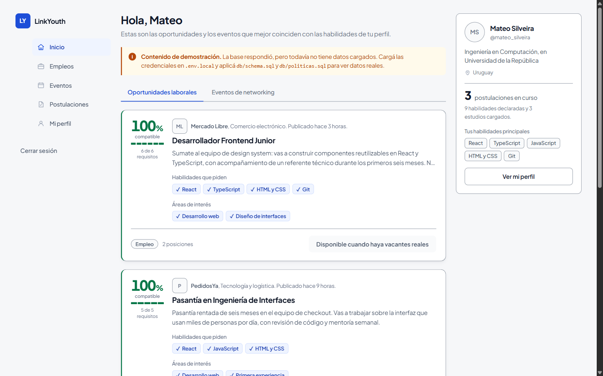

# Propuesta de diseño, v3: la misma app, con jerarquía

Una sola propuesta, conservadora. La v2 cambiaba la composición de raíz y se
sintió «otro producto»; además los prototipos no tenían navegación, así que se
leían incompletos. Esta vez: **la aplicación entera, navegable, reconocible**,
arreglando sólo lo que la hace sentir genérica.

- **Fecha:** 2026-09-13 · **Rama:** `main`, commit `30c7ed2`
- **Nada aplicado.** Todo vive en `docs/propuestas-diseno-v3/`, fuera de
  `src/`. El código de la aplicación no se tocó.
- **Misma paleta, misma tipografía, misma navegación.** Los tokens de color
  son literalmente los de `src/app/globals.css`. La barra lateral es la de
  `BarraLateral.tsx`. Las cinco pantallas conservan su estructura.

## Cómo probarlo

Abrí [`docs/propuestas-diseno-v3/inicio.html`](./propuestas-diseno-v3/inicio.html)
con doble clic y navegá con la barra lateral. **Los cinco enlaces funcionan de
verdad**, `aria-current` sigue a la pantalla activa, el buscador de `/empleos`
filtra mientras escribís y las pestañas de `/inicio` cambian de vista.

| Pantalla | Archivo | Escritorio | 390 px |
|---|---|---|---|
| Inicio | [`inicio.html`](./propuestas-diseno-v3/inicio.html) | [ver](./propuestas-diseno-v3/vista-inicio.png) | [ver](./propuestas-diseno-v3/movil-inicio.png) |
| Empleos | [`empleos.html`](./propuestas-diseno-v3/empleos.html) | [ver](./propuestas-diseno-v3/vista-empleos.png) | [ver](./propuestas-diseno-v3/movil-empleos.png) |
| Eventos | [`eventos.html`](./propuestas-diseno-v3/eventos.html) | [ver](./propuestas-diseno-v3/vista-eventos.png) | [ver](./propuestas-diseno-v3/movil-eventos.png) |
| Postulaciones | [`postulaciones.html`](./propuestas-diseno-v3/postulaciones.html) | [ver](./propuestas-diseno-v3/vista-postulaciones.png) | [ver](./propuestas-diseno-v3/movil-postulaciones.png) |
| Mi perfil | [`perfil.html`](./propuestas-diseno-v3/perfil.html) | [ver](./propuestas-diseno-v3/vista-perfil.png) | [ver](./propuestas-diseno-v3/movil-perfil.png) |

---

## 1. Jerarquía: cuatro niveles en vez de uno

Hoy existe un solo `--radius-tarjeta`, un solo borde y una sola
`--shadow-tarjeta`, y todo bloque los usa: una vacante, un evento, una sección
del perfil y un cartel de «no hay nada todavía» pesan exactamente lo mismo.
Acá hay cuatro niveles, y **el nivel dice qué tan importante es lo que estás
mirando**.

| Nivel | Qué | Superficie | Radio | Sombra | Título |
|---|---|---|---|---|---|
| 1 | Vacante | blanca + regla de 3 px a la izquierda | 12 px | elevación real | 18 px, 700 |
| 2 | Evento | blanca, plana | 10 px | ninguna | 16 px, 600 |
| 3 | Sección de perfil | blanca, plana, con regla bajo el título | 10 px | ninguna | 19 px, 700 |
| 4 | Aviso y estado vacío | **sin superficie propia** | — | ninguna | 16 px, 600 |

Lo importante es el nivel 4. El aviso de demostración pasa a ser una banda con
una regla de 3 px a la izquierda, y el estado vacío pasa a ser un rectángulo
de borde punteado sin fondo. Dejan de competir con el contenido: antes un
cartel de «no encontramos vacantes» tenía la misma presencia que una vacante
real.

La vacante es **lo único de la aplicación con elevación**. Con eso solo, el
feed deja de leerse como una pila uniforme.

---

## 2. El puntaje de compatibilidad, en el lugar que le corresponde

Era una insignia de 12 px en la esquina superior derecha, y encima
`hidden … sm:block` (`TarjetaVacante.tsx:74`): en un teléfono no existía. Es
lo único que LinkYouth hace y un portal de empleo común no.

Ahora ocupa una columna propia de 78 px a la izquierda de la tarjeta:

- **El número en 34 px**, peso 800, con cifras tabulares.
- **Una barra segmentada**: un tramo por requisito del puesto, lleno si ya lo
  declaraste. Es un gráfico dibujado, propio de este producto, no un ícono de
  librería.
- **El conteo literal** debajo: «6 de 6 requisitos».
- **La regla de 3 px del borde izquierdo toma el color del puntaje** —verde
  desde 70 %, azul entre 40 y 69, gris por debajo— así que la compatibilidad
  se percibe de reojo, antes de leer nada.

**Se ve en todos los anchos.** A 390 px la columna se convierte en una fila
horizontal arriba del título, en lugar de desaparecer.

---

## 3. Los tells de plantilla, uno por uno

| Tell | Dónde estaba | Qué hace ahora |
|---|---|---|
| `uppercase tracking-wide` de 11 px | `TarjetaVacante.tsx:84,99`, `TarjetaUsuario.tsx:79`, `NubeTags.tsx:47` | Rótulo en oración, 12,5 px, peso 500: «Habilidades que piden», «Áreas de interés», «Tus habilidades principales» |
| Degradado decorativo de 64 px | `TarjetaUsuario.tsx:30` | **Eliminado.** El avatar va en línea con el nombre, arriba a la izquierda |
| Cuatro degradados fijos de 112 px | `TarjetaEvento.tsx:16-19` | **Eliminados.** El bloque de fecha, que ya existía, se corre a la izquierda y pasa a ser el elemento gráfico de la tarjeta |
| `grid-cols-3` parejo de estadísticas | `TarjetaUsuario.tsx:58` | Una métrica principal —«**3** postulaciones en curso», número en 28 px— y las otras dos como una línea de contexto debajo |
| Cadenas con punto medio `A · B · C` | `TarjetaVacante.tsx:58,60` | Frase normal: «Mercado Libre, Comercio electrónico. Publicado hace 3 horas.» |

El punto medio no estaba en tu lista, pero es el mismo grupo de tells y salía
gratis al reescribir la tarjeta. Si preferís conservarlo, es un cambio de una
línea.

### Un ajuste más, de escala

El `h1` de pantalla sube de 20 px a 26 px. Entre el título de la página y el
cuerpo había 6 px de diferencia en toda la escala; ahora hay un escalón real.
Es el cambio más chico del documento y el que más se nota al entrar.

---

## 4. Lo que se verificó, y dos bugs que aparecieron

**Las cinco pantallas dan 0 violaciones en axe-core** (34, 38, 29, 29 y 33
comprobaciones pasadas). Para llegar ahí hubo que arreglar dos cosas, y **las
dos existen también en la aplicación real**:

1. **Salto de nivel de encabezado.** El título de una vacante y el de un
   evento son `h3` bajo un `h1` de pantalla, sin `h2` intermedio
   (`TarjetaVacante.tsx:64`, `TarjetaEvento.tsx:84`). En el prototipo pasaron a
   `h2`. En la app sigue igual.
2. **Contraste del paso no alcanzado.** El recorrido de `/postulaciones` pinta
   los pasos futuros con `text-tinta-tenue` `#98a2b3`, que sobre blanco da
   **2.58:1** — debajo del 4.5:1 que pide texto normal
   (`postulaciones/page.tsx:72`). En el prototipo pasó a `tinta-suave`
   `#667085`, 4.97:1. En la app sigue igual.

**A 390 px: sin desborde horizontal en ninguna de las cinco**
(`scrollWidth === clientWidth === 375`). Acá apareció el tercer bug, esta vez
sólo del prototipo: el contenedor de la barra lateral es el ítem de grilla y
le faltaba `min-width:0`, así que la fila de secciones empujaba la página a
615 px dentro de un viewport de 390. Es exactamente el mismo defecto que
arreglamos en `00dab5f` sobre `BarraLateral.tsx`, reaparecido por reproducir
el layout a mano.

**La navegación se probó recorriéndola**, no leyéndola: al hacer clic en cada
uno de los cinco enlaces de la barra, la página cambia, el título cambia y
`aria-current` se mueve al ítem correcto.

---

## 5. Lo que esto no resuelve

- **Las tarjetas siguen sin ser enlaces pero se levantan al hover** en la
  aplicación (`TarjetaVacante.tsx:45`, `TarjetaEvento.tsx:52`). En el
  prototipo saqué el `interactiva` porque no lleva a ningún lado; si se
  decide que la tarjeta entera navegue, eso es una decisión de producto
  aparte.
- **La paleta queda igual.** Si más adelante se elige alguna de las tres
  direcciones de `propuestas-diseno.md`, esta jerarquía es independiente y
  se puede combinar con cualquiera.
- **El prototipo es HTML plano.** No es el camino de migración: es la
  referencia visual. Llevarlo a los componentes reales implica tocar
  `Tarjeta.tsx` para que acepte un nivel, `TarjetaVacante`, `TarjetaEvento`,
  `TarjetaUsuario`, `EstadoVacio`, `AvisoOrigen` y `NubeTags`.
- Sigue abierto lo de `arquitectura.md` §7.6.
