# Propuestas de dirección de diseño

Tres direcciones para elegir **una**. Ninguna está aplicada: este documento es
para decidir. El código sigue con la paleta actual.

- **Fecha:** 2026-09-13
- **Rama:** `main`, commit `30c7ed2`
- **Tono pedido:** profesional y cálido. Serio para que una empresa la tome en
  serio, sin la frialdad corporativa.
- **Fuentes:** paletas, pares tipográficos y estilos salen de la base de la
  skill `ui-ux-pro-max`. La crítica de dirección visual sale de
  `frontend-design`. La revisión de interfaz sale de `web-design-guidelines`.

Las capturas se sacaron repintando la aplicación real —las cinco pantallas, con
sesión iniciada— inyectando las variables CSS de cada dirección en la página ya
cargada. No son maquetas: es el código de hoy con otros tokens.

---

## Cómo se ve hoy

| Pantalla | Captura |
|---|---|
| `/login` | 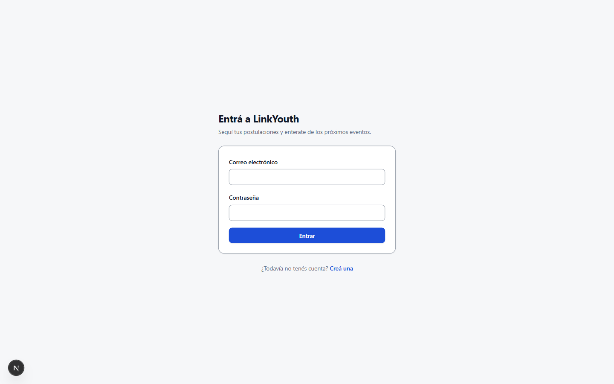 |
| `/inicio` | 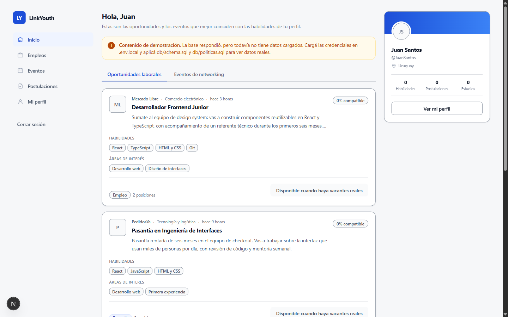 |
| `/empleos` | 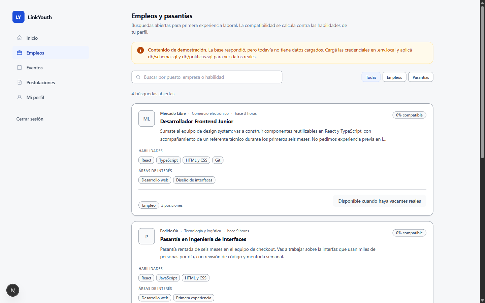 |
| `/perfil` | 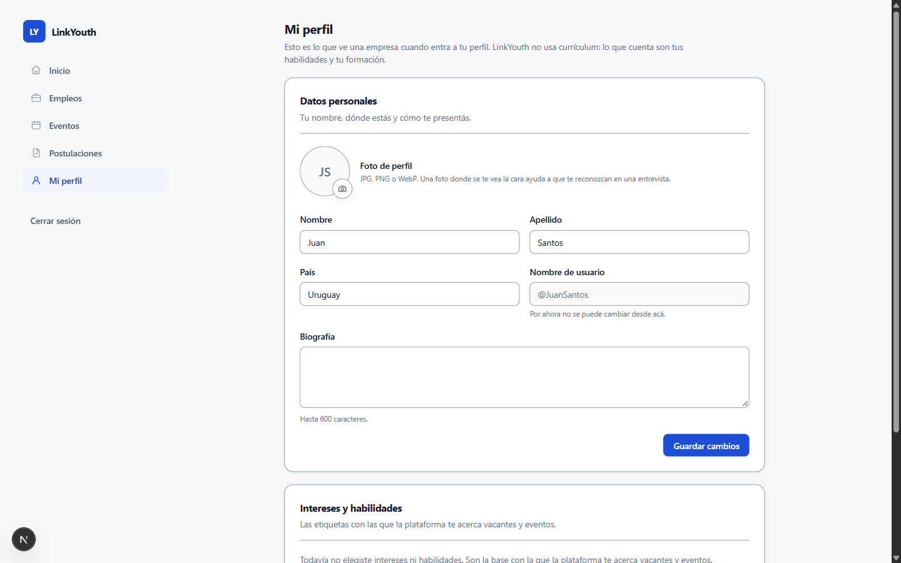 |
| `/registro` | 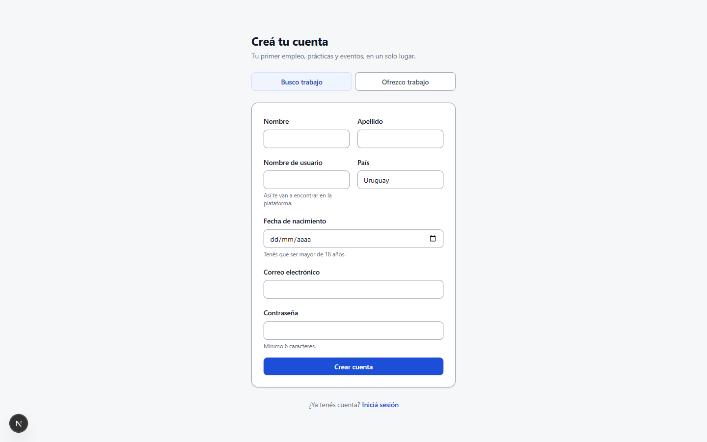 |

Lo que define el aspecto actual, para tener contra qué comparar:

- **Color.** Azul `#1d4ed8` como única voz cromática. Escala de grises fría
  (`#101828` → `#98a2b3`). El color aparece sólo en la acción y en el estado;
  el resto es gris sobre gris claro.
- **Tipografía.** Plus Jakarta Sans para todo, con JetBrains Mono en un solo
  lugar (`AvisoOrigen`). Escala muy comprimida: `h1` 20 px, `h2` 16 px, título
  de tarjeta 16 px, cuerpo 14 px, secundario 12 px. Entre el título de una
  tarjeta y su propio cuerpo hay 2 px; la jerarquía la sostiene el peso, no el
  tamaño.
- **Espaciado.** Ritmo consistente: `space-y-5` entre bloques, `space-y-4`
  entre ítems, `p-5` en tarjeta de contenido, `p-6` en tarjeta de formulario.
- **Forma.** Radio 8 px en controles, 14 px en tarjetas. Sombras de opacidad
  muy baja (0.04–0.12).

---

## Un problema que traen las tres, y cómo se resolvió

Las paletas que devuelve la base de `ui-ux-pro-max` traen un `border` pensado
como decoración, no como contorno de control. Medido:

| Paleta de origen | Borde propuesto | Contra blanco | WCAG 1.4.11 pide |
|---|---|---|---|
| Job Board / Recruitment | `#BAE6FD` | 1.33:1 | 3:1 |
| LMS | `#5EEAD4` | 1.48:1 | 3:1 |
| Membership / Community | `#DDD6FE` | 1.44:1 | 3:1 |

Es exactamente el defecto que se corrigió en `00dab5f` y que hacía que los
campos no se leyeran como campos. **En las tres direcciones de abajo el borde
está recalculado** para dar ≥3:1 contra la superficie, contra el lienzo y
contra la superficie suave, con `borde-fuerte` siempre más oscuro que `borde`
para que el hover oscurezca y no aclare.

Lo mismo con el teal de la dirección B: `#0D9488` da 3.74:1 con texto blanco
encima, debajo del 4.5:1 que pide un botón. Se bajó a `#0F766E` (5.47:1).

Los números de cada dirección están medidos, no estimados.

---

## Dirección A — «Confianza»

> Estilo base: **Flat Design** · Par tipográfico: **Corporate Trust**

**Por qué encaja con el tono.** Mantiene el azul institucional que una empresa
lee como seriedad, y pone la calidez en los neutros —grises con una pizca de
azul en vez de grises puros— y en un verde de confirmación que no es el verde
chillón de los formularios.

**Par tipográfico.** Lexend (títulos) + Source Sans 3 (cuerpo). Lexend está
diseñado específicamente para legibilidad y reduce el esfuerzo de lectura;
Source Sans 3 es una humanista de texto que aguanta bien el español con
tildes y eñes en 14–16 px.

**Contrastes medidos**

| Par | Ratio | Mínimo |
|---|---|---|
| tinta / tarjeta | 17.42:1 | 4.5 |
| tinta-media / tarjeta | 9.67:1 | 4.5 |
| tinta-suave / lienzo | 5.47:1 | 4.5 |
| blanco / primario (botón) | 5.93:1 | 4.5 |
| blanco / primario-fuerte (hover) | 7.56:1 | 4.5 |
| primario / lienzo (enlace) | 5.42:1 | 4.5 |
| primario-fuerte / primario-suave (nav activa) | 6.59:1 | 4.5 |
| tinta-media / superficie-suave (deshabilitado) | 9.24:1 | 4.5 |
| borde / superficie | 3.57:1 | 3.0 |
| borde / lienzo | 3.26:1 | 3.0 |
| borde / superficie-suave | 3.41:1 | 3.0 |

**Variables, listas para pegar en `globals.css`**

```css
@theme {
  /* Superficies */
  --color-lienzo: #f1f5f9;
  --color-superficie: #ffffff;
  --color-superficie-suave: #f8fafc;
  --color-borde: #748aa0;
  --color-borde-fuerte: #5a6b7d;

  /* Texto */
  --color-tinta: #0c1b2a;
  --color-tinta-media: #33465c;
  --color-tinta-suave: #52657a;
  --color-tinta-tenue: #8096a8;

  /* Acción */
  --color-primario: #0369a1;
  --color-primario-fuerte: #075985;
  --color-primario-suave: #e0f2fe;
  --color-primario-borde: #7dd3fc;

  /* Estado */
  --color-exito: #15803d;
  --color-exito-suave: #ecfdf5;
  --color-exito-borde: #86efac;
  --color-aviso: #b45309;
  --color-aviso-suave: #fffbeb;
  --color-aviso-borde: #fcd34d;
  --color-alerta: #b42318;
  --color-alerta-suave: #fef2f2;
  --color-alerta-borde: #fecaca;

  /* Tipografía */
  --font-sans: var(--font-source-sans), ui-sans-serif, system-ui, sans-serif;
  --font-titulo: var(--font-lexend), ui-sans-serif, system-ui, sans-serif;

  /* Radios: un punto más apretados que hoy */
  --radius-control: 0.375rem;
  --radius-tarjeta: 0.5rem;
}
```

```
https://fonts.googleapis.com/css2?family=Lexend:wght@400;500;600;700&family=Source+Sans+3:wght@400;500;600;700&display=swap
```

**Cómo queda cada pantalla**

| Pantalla | Captura |
|---|---|
| `/login` |  |
| `/inicio` |  |
| `/empleos` | 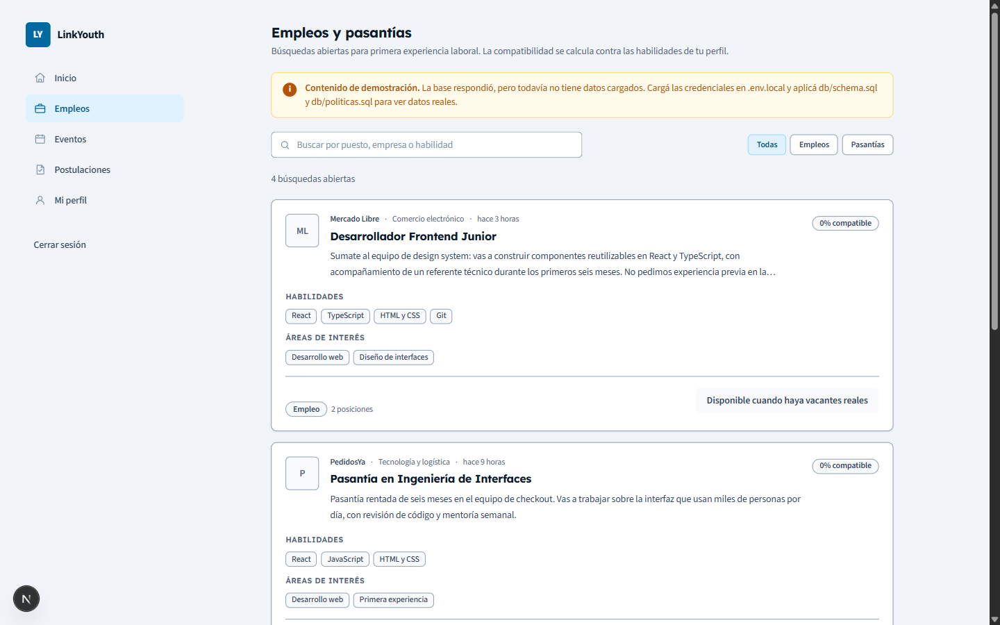 |
| `/perfil` | 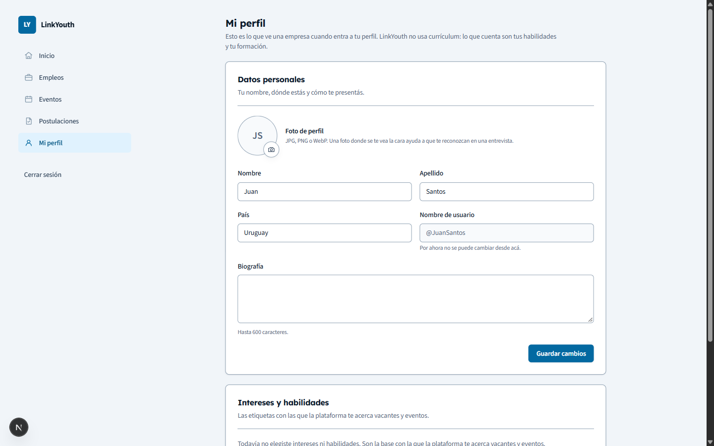 |
| `/registro` | 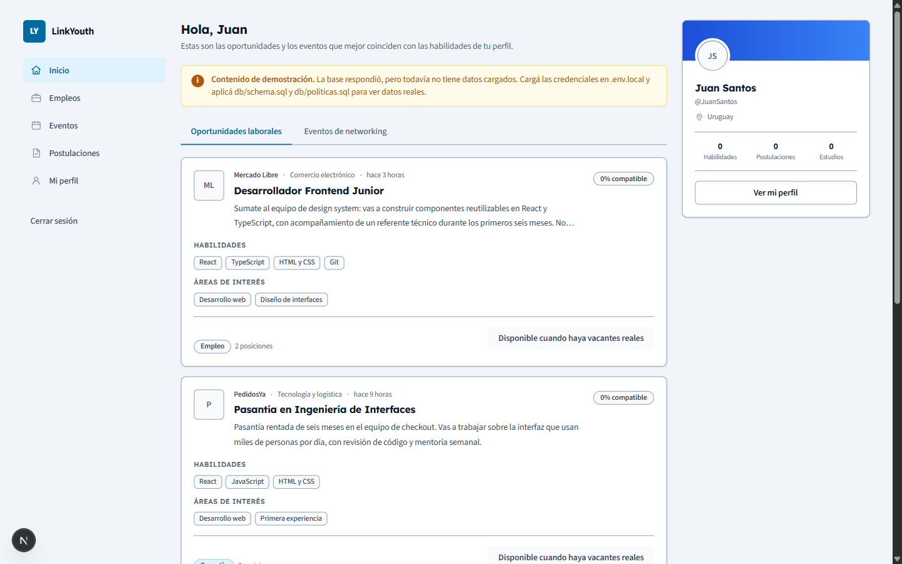 |

**Qué cambia concretamente**

- **Color.** El azul pasa de `#1d4ed8` (azul violáceo, saturado) a `#0369a1`
  (azul de cielo profundo). Es el cambio menos visible de los tres: en
  `/login` el botón «Entrar» y el enlace «Creá una» se ven un tono más
  apagado y un punto más oscuro; en `/inicio` el badge **LY**, la pestaña
  activa y la fila de navegación seleccionada siguen leyéndose igual de
  claramente. El lienzo pasa de `#f6f7f9` a `#f1f5f9`, apenas más frío.
- **Tipografía.** Lexend en los títulos abre las contraformas: «Hola, Juan»,
  «Empleos y pasantías» y «Mi perfil» ganan un par de píxeles de ancho y se
  leen más abiertos. El cuerpo en Source Sans 3 se vuelve algo más angosto,
  así que las descripciones de vacante entran más palabras por línea: en
  `/empleos` la descripción de la primera tarjeta pasa de cortarse en «en l…»
  a llegar un poco más lejos.
- **Espaciado.** Sin cambios. El ritmo de hoy se mantiene entero.
- **Forma.** Radio de tarjeta de 14 px a 8 px y de control de 8 px a 6 px: las
  tarjetas se ven un poco menos «app» y un poco más «documento». Los chips de
  habilidad (`React`, `TypeScript`) quedan casi rectangulares.

**Riesgo.** Es la opción que menos se nota. Si el objetivo es que la
plataforma deje de parecerse a cualquier dashboard, esta dirección no lo
resuelve: cambia el tono del azul, no la personalidad.

---

## Dirección B — «Campus»

> Estilo base: **Soft UI Evolution** · Par tipográfico: **Vietnamese Friendly**

**Por qué encaja con el tono.** El teal es el color con el que la base de la
skill identifica los productos educativos, y el ámbar que lo acompaña aporta
la calidez sin recurrir al naranja de marca de consumo: es la combinación
«institución educativa» más que «empresa de software».

**Par tipográfico.** Be Vietnam Pro (títulos) + Noto Sans (cuerpo). Be Vietnam
Pro es una grotesca humanista con terminaciones suaves, más cálida que Poppins
y bastante menos vista. Noto Sans es una de texto con cobertura amplísima, lo
que importa si más adelante hay nombres, instituciones o acentos raros.

> La base devolvía **Poppins + Open Sans** («Modern Professional») como primer
> resultado para «profesional + cálido». Se descartó: Poppins es probablemente
> el par más usado de Google Fonts y `frontend-design` marca justamente ese
> tipo de elección por defecto. Be Vietnam Pro cubre el mismo registro sin
> sonar a plantilla.

**Contrastes medidos**

| Par | Ratio | Mínimo |
|---|---|---|
| tinta / tarjeta | 13.84:1 | 4.5 |
| tinta-media / tarjeta | 8.04:1 | 4.5 |
| tinta-suave / lienzo | 5.62:1 | 4.5 |
| blanco / primario (botón) | 5.47:1 | 4.5 |
| blanco / primario-fuerte (hover) | 7.58:1 | 4.5 |
| primario / lienzo (enlace) | 5.06:1 | 4.5 |
| primario-fuerte / primario-suave (nav activa) | 7.20:1 | 4.5 |
| tinta-media / superficie-suave (deshabilitado) | 7.65:1 | 4.5 |
| borde / superficie | 3.64:1 | 3.0 |
| borde / lienzo | 3.37:1 | 3.0 |
| borde / superficie-suave | 3.46:1 | 3.0 |

**Variables, listas para pegar en `globals.css`**

```css
@theme {
  /* Superficies */
  --color-lienzo: #f2f7f6;
  --color-superficie: #ffffff;
  --color-superficie-suave: #f6faf9;
  --color-borde: #6e8c87;
  --color-borde-fuerte: #55706b;

  /* Texto */
  --color-tinta: #10322e;
  --color-tinta-media: #3c5551;
  --color-tinta-suave: #4f6764;
  --color-tinta-tenue: #7d9490;

  /* Acción */
  --color-primario: #0f766e;
  --color-primario-fuerte: #115e59;
  --color-primario-suave: #ecfdf5;
  --color-primario-borde: #5eead4;

  /* Estado */
  --color-exito: #15803d;
  --color-exito-suave: #ecfdf5;
  --color-exito-borde: #86efac;
  --color-aviso: #b45309;
  --color-aviso-suave: #fffbeb;
  --color-aviso-borde: #fcd34d;
  --color-alerta: #b42318;
  --color-alerta-suave: #fef2f2;
  --color-alerta-borde: #fecaca;

  /* Tipografía */
  --font-sans: var(--font-noto-sans), ui-sans-serif, system-ui, sans-serif;
  --font-titulo: var(--font-be-vietnam), ui-sans-serif, system-ui, sans-serif;

  /* Radios: más blandos que hoy */
  --radius-control: 0.75rem;
  --radius-tarjeta: 1rem;
}
```

```
https://fonts.googleapis.com/css2?family=Be+Vietnam+Pro:wght@500;600;700&family=Noto+Sans:wght@400;500;600;700&display=swap
```

**Cómo queda cada pantalla**

| Pantalla | Captura |
|---|---|
| `/login` | 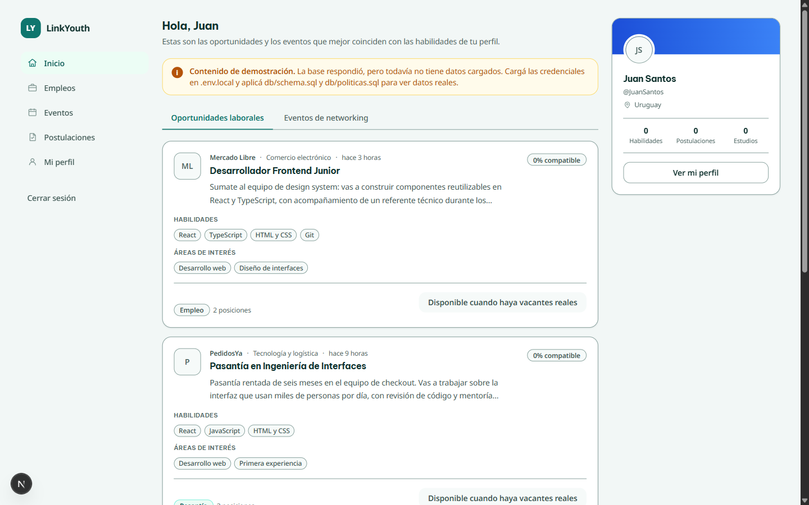 |
| `/inicio` |  |
| `/empleos` | 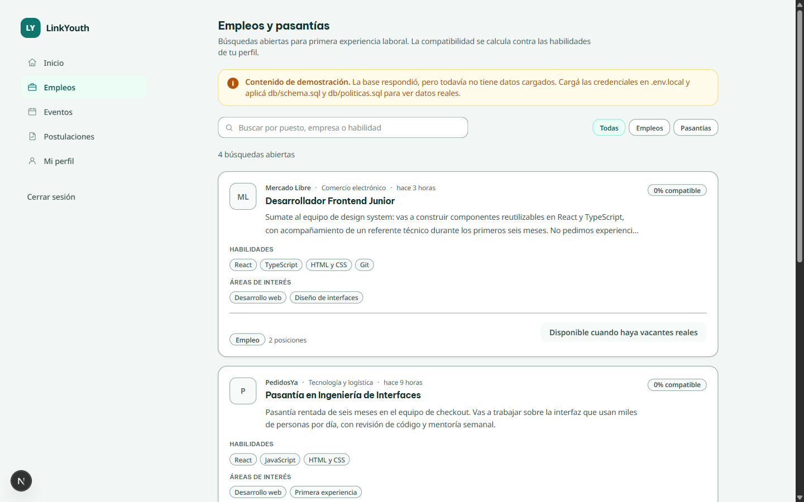 |
| `/perfil` | 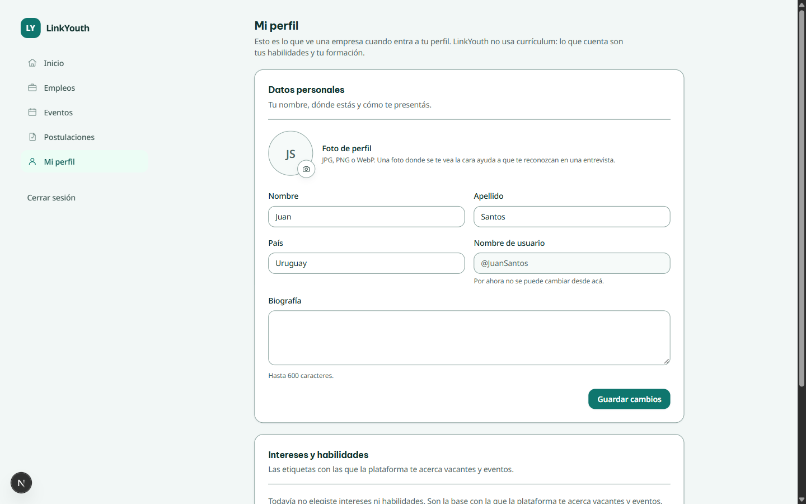 |
| `/registro` |  |

**Qué cambia concretamente**

- **Color.** Es el cambio de identidad más grande sin ser arriesgado. En
  `/inicio` el badge **LY** pasa de azul a verde petróleo, la pestaña activa
  «Oportunidades laborales» y su subrayado se vuelven teal, y la fila
  «Inicio» de la navegación queda sobre un verde muy pálido en vez de un azul
  pálido. El lienzo toma un tinte verdoso (`#f2f7f6`) que se nota sobre todo
  en las zonas vacías de `/perfil`. Los chips de habilidad heredan el borde
  teal y dejan de ser grises.
- **Tipografía.** Be Vietnam Pro tiene un ojo medio más grande, así que los
  títulos de tarjeta («Desarrollador Frontend Junior») ocupan casi el mismo
  ancho pero se ven más presentes. Noto Sans en el cuerpo es levemente más
  ancho que Plus Jakarta: las descripciones de vacante se cortan un poco
  antes, visible en `/empleos`.
- **Espaciado.** Sin cambios en el ritmo, pero el radio más blando hace que
  las tarjetas parezcan tener más aire del que tienen.
- **Forma.** Es donde más se aleja de hoy: radio de tarjeta de 14 px a 16 px y
  de control de 8 px a 12 px. Los botones y los campos se redondean
  claramente; los chips de habilidad pasan a ser cápsulas.

**Riesgo.** El teal y el verde de `exito` conviven en la misma pantalla. En
`/postulaciones`, una insignia «Aceptada» en verde al lado de elementos
primarios en teal puede leerse como el mismo estado. Si se elige esta
dirección hay que separarlos: o `exito` se corre hacia un verde más frío, o el
estado positivo deja de apoyarse sólo en el color.

---

## Dirección C — «Expediente»

> Estilo base: **Editorial Grid / Magazine** (sólo la estructura) · Par
> tipográfico: **Minimalist Portfolio**

**Por qué encaja con el tono.** La calidez viene de los neutros —una escala
gris con temperatura, no gris azulado— y la seriedad de un violeta profundo
que no se parece al azul de todas las plataformas de empleo; es la única de
las tres que se puede reconocer de lejos.

**Par tipográfico.** Archivo (títulos) + Space Grotesk (cuerpo). Archivo es
una grotesca de origen tipográfico institucional, pensada para señalética y
formularios impresos: da autoridad sin recurrir a una serif. Space Grotesk
tiene suficiente carácter para que la interfaz no se lea neutra.

> **Esta dirección se rehizo.** La primera versión era crema `#fbf7f0` +
> Newsreader (serif de alto contraste) + terracota `#9a3412`. `frontend-design`
> identifica exactamente esa combinación —fondo crema cercano a `#f4f1ea`,
> display serif, acento terracota cercano a `#d97757`— como el grupo número
> uno del diseño generado por IA. Se cambió por completo: neutro gris cálido
> en vez de crema, grotesca en vez de serif, violeta en vez de terracota.

**Contrastes medidos**

| Par | Ratio | Mínimo |
|---|---|---|
| tinta / tarjeta | 17.13:1 | 4.5 |
| tinta-media / tarjeta | 9.57:1 | 4.5 |
| tinta-suave / lienzo | 6.07:1 | 4.5 |
| blanco / primario (botón) | 8.98:1 | 4.5 |
| blanco / primario-fuerte (hover) | 10.95:1 | 4.5 |
| primario / lienzo (enlace) | 7.96:1 | 4.5 |
| primario-fuerte / primario-suave (nav activa) | 9.64:1 | 4.5 |
| tinta-media / superficie-suave (deshabilitado) | 8.94:1 | 4.5 |
| borde / superficie | 3.88:1 | 3.0 |
| borde / lienzo | 3.44:1 | 3.0 |
| borde / superficie-suave | 3.63:1 | 3.0 |

**Variables, listas para pegar en `globals.css`**

```css
@theme {
  /* Superficies */
  --color-lienzo: #f2f1ef;
  --color-superficie: #ffffff;
  --color-superficie-suave: #f8f7f6;
  --color-borde: #847f8e;
  --color-borde-fuerte: #6b6676;

  /* Texto */
  --color-tinta: #1c1b1f;
  --color-tinta-media: #46444d;
  --color-tinta-suave: #5b5966;
  --color-tinta-tenue: #8b8898;

  /* Acción */
  --color-primario: #5b21b6;
  --color-primario-fuerte: #4c1d95;
  --color-primario-suave: #f3eeff;
  --color-primario-borde: #c9b6f5;

  /* Estado */
  --color-exito: #15803d;
  --color-exito-suave: #ecfdf5;
  --color-exito-borde: #86efac;
  --color-aviso: #b45309;
  --color-aviso-suave: #fffbeb;
  --color-aviso-borde: #fcd34d;
  --color-alerta: #b42318;
  --color-alerta-suave: #fef2f2;
  --color-alerta-borde: #fecaca;

  /* Tipografía */
  --font-sans: var(--font-space-grotesk), ui-sans-serif, system-ui, sans-serif;
  --font-titulo: var(--font-archivo), ui-sans-serif, system-ui, sans-serif;

  /* Radios */
  --radius-control: 0.375rem;
  --radius-tarjeta: 0.625rem;
}
```

```
https://fonts.googleapis.com/css2?family=Archivo:wght@500;600;700&family=Space+Grotesk:wght@400;500;600;700&display=swap
```

**Cómo queda cada pantalla**

| Pantalla | Captura |
|---|---|
| `/login` | 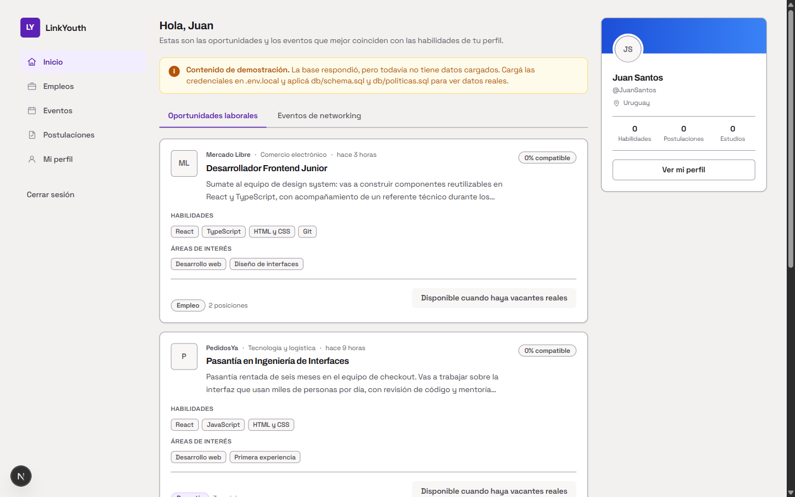 |
| `/inicio` |  |
| `/empleos` | 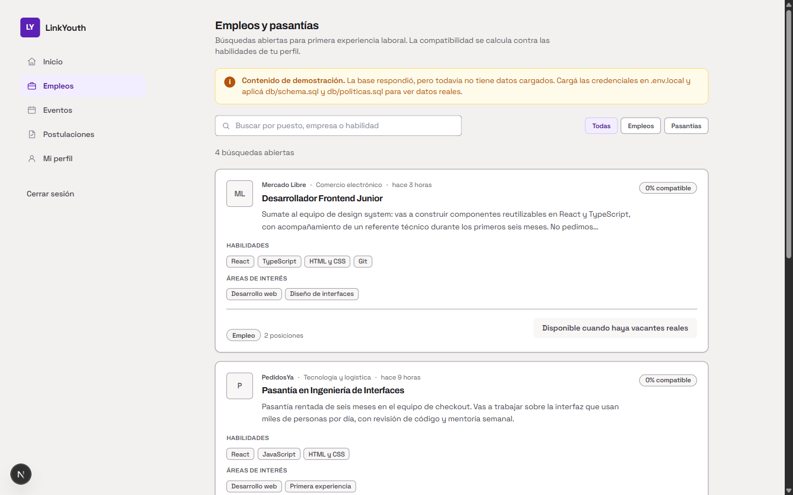 |
| `/perfil` | 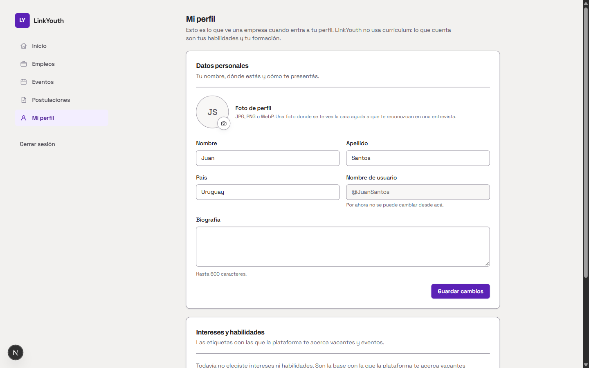 |
| `/registro` |  |

**Qué cambia concretamente**

- **Color.** El badge **LY** y el botón primario pasan a violeta profundo. El
  lienzo deja de ser gris azulado y se vuelve gris cálido: en `/perfil`, donde
  hay mucha superficie vacía, el fondo se percibe claramente más templado. La
  navegación activa queda sobre un lila muy pálido. El violeta contra el rojo
  de `alerta` y el verde de `exito` está bien separado en tono, así que ningún
  estado compite con la acción primaria.
- **Tipografía.** Es el cambio más audible de los tres. Space Grotesk en el
  cuerpo tiene una `y` de descendente recta y una `g` de un solo piso: se nota
  en cada descripción de vacante. Archivo en los títulos es más estrecho y más
  firme que Plus Jakarta; «Empleos y pasantías» ocupa menos ancho y pesa más.
- **Espaciado.** Sin cambios de ritmo. Con el radio chico y el borde más
  visible, las tarjetas se leen como fichas de un archivo en vez de como
  paneles flotantes.
- **Forma.** Radio de tarjeta de 14 px a 10 px, control de 8 px a 6 px.

**Riesgo.** Space Grotesk como tipografía de cuerpo en 14 px para textos
largos en español es discutible: tiene carácter, y el carácter en el cuerpo
cansa. Si se elige esta dirección, la prueba real es leer tres descripciones
de vacante seguidas en `/empleos`. La alternativa es quedarse con Archivo en
títulos y una de texto más neutra en el cuerpo.

---

## Lo que ninguna dirección arregla sola

Esto sale de mirar las capturas contra `frontend-design` y
`web-design-guidelines`. Son cosas que hay que decidir aparte del color.

### Dos degradados están fuera del sistema de tokens

```
src/components/perfil/TarjetaUsuario.tsx:30   from-[#1d4ed8] to-[#3b82f6]
src/components/eventos/TarjetaEvento.tsx:16-19  cuatro franjas fijas
```

Se ve en las capturas: en B y en C la cabecera de la tarjeta de perfil sigue
siendo **azul**, con el resto de la pantalla ya en teal o en violeta. Cualquier
dirección que se elija necesita tocar esos cinco valores a mano; un cambio de
tokens no los alcanza.

### La escala tipográfica es demasiado plana

Entre `h1` (20 px), `h2` (16 px), título de tarjeta (16 px) y cuerpo (14 px)
hay 6 px en total. `frontend-design` pide una escala con intención; hoy la
jerarquía la sostiene casi sólo el peso de la fuente. Ninguna de las tres
direcciones cambia esto: hay que decidir una escala. Una propuesta razonable
para las tres es 28 / 20 / 16 / 14 / 12.

### La tarjeta se levanta al pasar el puntero pero no lleva a ningún lado

`TarjetaVacante.tsx:42` y `TarjetaEvento.tsx:49` usan `interactiva`, que aplica
`translateY(-1px)` y sombra elevada, pero ninguna de las dos es un enlace.
Promete una navegación que no existe. Es la clase de detalle que hace que una
interfaz se sienta poco cuidada, independientemente de la paleta.

### El aviso de demostración domina la pantalla

En `/inicio` y `/empleos` el bloque ámbar de «Contenido de demostración» ocupa
dos líneas de ancho completo, arriba de todo, y es lo primero que se ve. Con
las paletas B y C ese ámbar deja de pertenecer a la familia cromática y pesa
todavía más. Cuando haya datos reales desaparece, pero mientras tanto define la
primera impresión de la aplicación.

### Queda pendiente de la auditoría anterior

Ver `arquitectura.md` §7.6. En particular, y visible en estas capturas: la
insignia de compatibilidad es `hidden sm:block` (no existe en teléfono), el
ancho de la columna de contenido cambia entre pantallas (`/inicio` con columna
derecha, `/empleos` `max-w-4xl`, `/perfil` `max-w-3xl`), y los blancos táctiles
rondan los 36–40 px.

---

## Para decidir

| | A · Confianza | B · Campus | C · Expediente |
|---|---|---|---|
| **Primario** | `#0369a1` azul cielo | `#0f766e` teal | `#5b21b6` violeta |
| **Títulos / cuerpo** | Lexend / Source Sans 3 | Be Vietnam Pro / Noto Sans | Archivo / Space Grotesk |
| **Cuánto cambia** | Poco | Bastante | Mucho |
| **Riesgo principal** | No se distingue de cualquier dashboard | Teal y verde de éxito compiten | Space Grotesk cansa en cuerpo largo |
| **Calidez** | En los neutros | En el ámbar | En los neutros |
| **Contrastes** | Todos pasan | Todos pasan | Todos pasan |

Las tres paletas están medidas y cumplen WCAG AA en texto y 1.4.11 en bordes.
La elección es de tono, no de accesibilidad.
